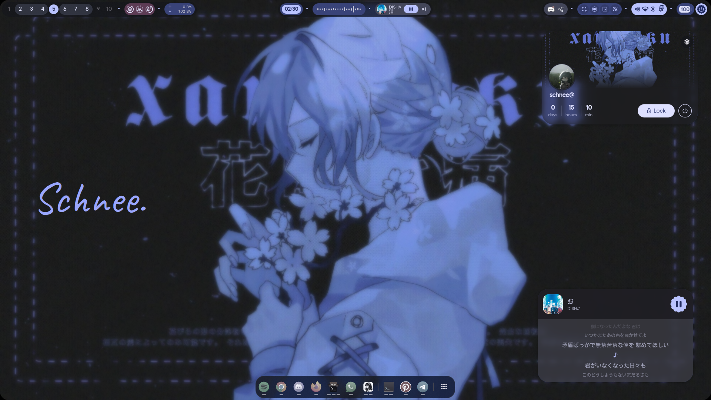
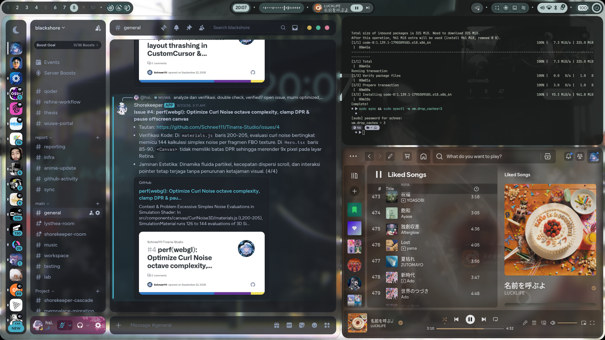
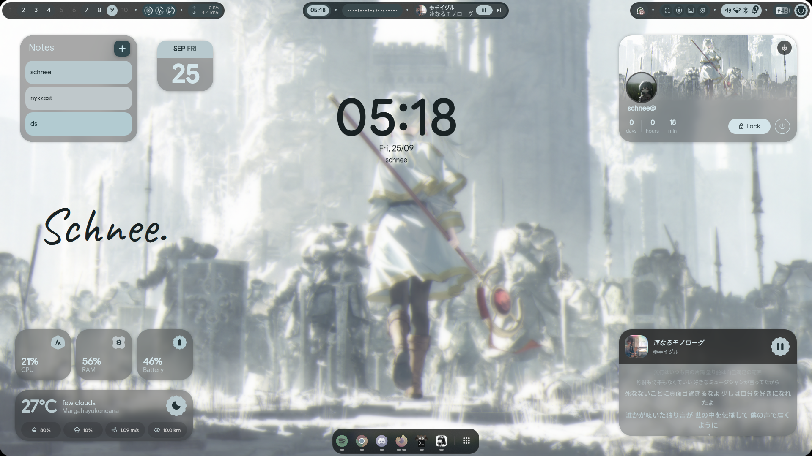
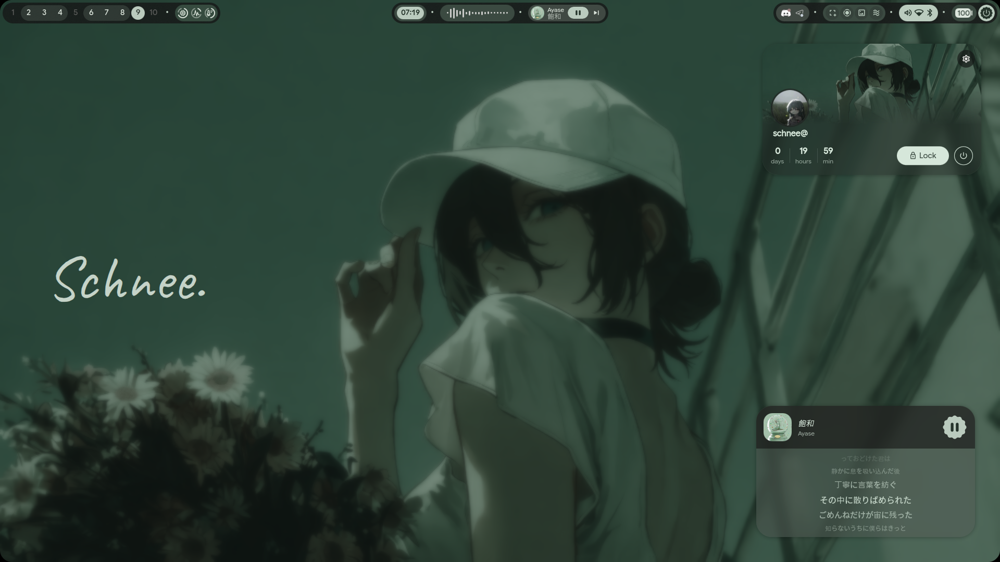

# ❄️ schnee's dotfiles

Personal dotfiles and configurations for **Fedora Linux 44** running **Hyprland** with **Quickshell** (Material 3 / end-4 framework). Crafted for a clean, minimalist, macOS-like aesthetic with tailored productivity and gaming workflows.

## 📸 Showcase / Gallery

<p align="center">
  
  
</p>
<p align="center">
  
  
</p>

---

## 💻 Hardware & System Specs

| Component | Specification |
| :--- | :--- |
| **OS** | Fedora Linux 44 (Workstation Edition) |
| **Kernel** | Linux 7.2.x x86_64 |
| **Compositor** | Hyprland (Wayland) |
| **Shell / Widgets** | Quickshell (end4-pC / Material 3) |
| **Launcher** | Rofi 2.0 (Custom macOS Launchpad Grid) |
| **Terminal** | Kitty with Fish shell & Starship prompt |
| **Laptop Hardware** | ASUS (TigerLake Intel Iris Xe GT2) |
| **Laptop Display** | 14-inch 2.8K 90Hz OLED (`eDP-1`, 1.5x scale / 1920x1200 logical) |
| **External Monitor** | Xiaomi Mi Desktop Monitor 1080p @ 200Hz (`HDMI-A-1`, 1.0x scale) |
| **Audio DAC** | Intel Tiger Lake-LP Smart Sound Technology (SOF) |
| **Mouse** | Ajazz AJ139 V2 MC (PAW3311, WebHID driver) |

---

## ✨ Features & Highlights

- **Smart Display Switcher**: One-click display profiles via Rofi (`display_switch.sh`) supporting Single External (with laptop OLED turned off to preserve panel life), Laptop Only, Mirror, and Extend.
- **macOS Launchpad Grid**: Custom fullscreen 6x4 app launcher grid in Rofi dynamically themed to Quickshell / Matugen Material You colors.
- **Dedicated Workspaces**: Window rules mapped cleanly:
  - Workspace 2: Terminal (Kitty)
  - Workspace 3: Discord & Hermes Agent
  - Workspace 4: Google Chrome
  - Workspace 6: WhatsApp PWA
  - Workspace 7: Firefox
  - Workspace 8: Spotify
- **Hardware-Calibrated Audio**: PipeWire filter-chain DSP module (`10-headphone-balance.conf`) providing precise channel rebalancing (+0.15 right balance) for ASUS SOF DAC.
- **Streamlined Media & Screenshots**:
  - Fullscreen screenshot on `Print` with shutter audio, clipboard copy, preview notification, and file saving to `~/Pictures/Screenshots/`.
  - Area snippet on `SUPER + SHIFT + S` with Swappy annotation configured to save directly to `~/Pictures/Screenshots/`.
  - Screen recording automatically routed to `~/Videos/Recordings/`.

---

## ⌨️ Keybindings Cheat Sheet

| Shortcut | Action |
| :--- | :--- |
| `SUPER + Space` | Open macOS-style Launchpad (Rofi grid) |
| `SUPER + F8` / `SUPER + P` | Open Display Switcher menu (Rofi) |
| `Print` | Fullscreen screenshot (auto-save + clipboard + sound) |
| `SUPER + SHIFT + S` | Area screenshot & annotate (Swappy) |
| `Alt + Tab` / `Alt + Shift + Tab` | Cycle active windows (`cycle_next` + focus) |
| `SUPER + ALT + V` | Toggle Audio Output (Speaker / Headphones) |
| `SUPER + N` | Open Quick Notification Sidebar |
| `SUPER + Q` | Close active window |
| `SUPER + Return` | Open Kitty terminal |

---

## 📁 Repository Structure

```text
.
├── .gitignore
├── install.sh                  # Automated installer & symlink script
├── README.md                   # System documentation & cheat-sheet
├── hypr/
│   ├── monitors.lua            # Dual-monitor scaling and refresh rates
│   ├── custom/                 # Hyprland modular configuration
│   │   ├── env.lua             # Custom environment variables
│   │   ├── execs.lua           # Autostart applications
│   │   ├── general.lua         # Layout, gaps, and borders
│   │   ├── keybinds.lua        # Keybind overrides
│   │   ├── rules.lua           # Window and workspace rules
│   │   └── variables.lua       # Custom variables
│   └── scripts/
│       ├── audio_output_toggle.sh    # Toggle SOF audio outputs
│       ├── display_switch.sh         # Rofi display profile switcher
│       └── screenshot_fullscreen.sh  # Complete screenshot pipeline
├── rofi/
│   ├── launcher.sh             # Launchpad launcher with theme sync
│   ├── launchpad.rasi          # Fullscreen grid layout
│   ├── display.rasi            # Display switcher menu layout
│   └── colors.rasi             # Material You dynamic colors
├── kitty/
│   └── kitty.conf              # Font, padding, and fish shell
├── fish/
│   └── config.fish             # Aliases, transients, and prompt
├── starship/
│   └── starship.toml           # Minimalist starship prompt
├── pipewire/
│   └── 10-headphone-balance.conf # Channel balance DSP filter
└── swappy/
    └── config                  # Screenshot save path configuration
```

---

## 🚀 Installation

### 1. Clone the repository
```bash
git clone https://github.com/Schnee111/dotfiles.git ~/Projects/dotfiles
cd ~/Projects/dotfiles
```

### 2. Preview changes (Dry Run)
```bash
./install.sh --dry-run
```

### 3. Install & Symlink
```bash
./install.sh
```
*Note: Existing configuration files will automatically be backed up to `~/.config/dotfiles_backup_<timestamp>/` before creating symbolic links.*

---

## 🙏 Credits & Acknowledgements

- [end-4/dots-hyprland](https://github.com/end-4/dots-hyprland) for the incredible base framework.
- [Quickshell](https://outfoxxed.me/quickshell/) for the reactive desktop widget environment.
- [Material You / Matugen](https://github.com/InioX/matugen) for automatic color palette generation.
