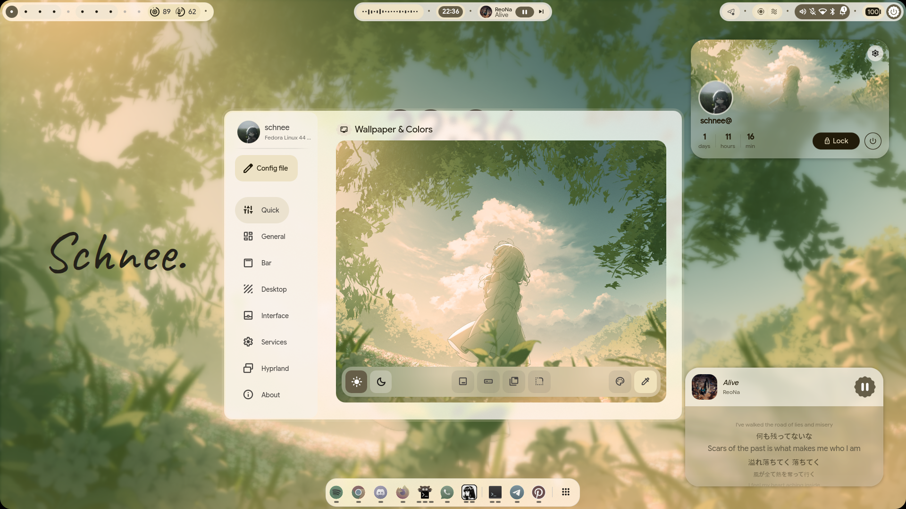

# schnee's dotfiles

Personal dotfiles and configurations for **Fedora Linux 44** running **Hyprland** with **Quickshell** (Material 3 / end-4 framework). Crafted with a clean, minimalist frosted glassmorphism aesthetic tailored for productivity and gaming workflows.

## Showcase

<p align="center">
  
  
</p>
<p align="center">
  
  
</p>

---

## Specifications

| Component | Specification |
| :--- | :--- |
| **OS** | Fedora Linux 44 (Workstation Edition) |
| **Kernel** | Linux 7.2.x x86_64 |
| **Compositor** | Hyprland (Wayland) |
| **Shell / Widgets** | Quickshell (end4-pC / Material 3) |
| **Launcher** | Rofi 2.0 (Custom Launchpad Grid) |
| **Terminal** | Kitty with Fish shell & Starship prompt |
| **Laptop Hardware** | ASUS (TigerLake Intel Iris Xe GT2) |
| **Laptop Display** | 14-inch 2.8K 90Hz OLED (`eDP-1`, 1.5x scale) |
| **External Monitor** | Xiaomi Mi Desktop Monitor 1080p @ 200Hz (`HDMI-A-1`, 1.0x scale) |
| **Audio DAC** | Intel Tiger Lake-LP Smart Sound Technology (SOF) |
| **Mouse** | Ajazz AJ139 V2 MC (PAW3311, WebHID driver) |

---

## Repository Structure

```text
.
├── .gitattributes              # GitHub Linguist overrides
├── .gitignore
├── install.sh                  # Automated installer & symlink script
├── README.md                   # System documentation
├── hypr/
│   ├── monitors.lua            # Dual-monitor scaling and refresh rates
│   ├── custom/                 # Hyprland modular configuration
│   │   ├── env.lua             # Custom environment variables
│   │   ├── execs.lua           # Autostart applications
│   │   ├── general.lua         # Layout, gaps, and borders
│   │   ├── keybinds.lua        # Keybind overrides
│   │   ├── rules.lua           # Window and workspace rules
│   │   └── variables.lua       # Custom variables
│   └── scripts/
│       ├── audio_output_toggle.sh    # Toggle SOF audio outputs
│       ├── display_switch.sh         # Rofi display profile switcher
│       └── screenshot_fullscreen.sh  # Complete screenshot pipeline
├── rofi/
│   ├── launcher.sh             # Launchpad launcher with theme sync
│   ├── launchpad.rasi          # Fullscreen grid layout
│   ├── display.rasi            # Display switcher menu layout
│   └── colors.rasi             # Material You dynamic colors
├── kitty/
│   └── kitty.conf              # Font, padding, and fish shell
├── fish/
│   └── config.fish             # Aliases, transients, and prompt
├── starship/
│   └── starship.toml           # Minimalist starship prompt
├── pipewire/
│   └── 10-headphone-balance.conf # Channel balance DSP filter
└── swappy/
    └── config                  # Screenshot save path configuration
```

---

## Installation

### 1. Clone the repository
```bash
git clone https://github.com/Schnee111/dotfiles.git ~/Projects/dotfiles
cd ~/Projects/dotfiles
```

### 2. Preview changes (Dry Run)
```bash
./install.sh --dry-run
```

### 3. Install & Symlink
```bash
./install.sh
```
*Note: Existing configuration files will automatically be backed up to `~/.config/dotfiles_backup_<timestamp>/` before creating symbolic links.*

---

## Credits

- [end-4/dots-hyprland](https://github.com/end-4/dots-hyprland) for the base framework.
- [Quickshell](https://outfoxxed.me/quickshell/) for the reactive desktop widget environment.
- [Material You / Matugen](https://github.com/InioX/matugen) for automatic color palette generation.
